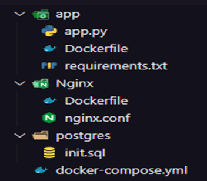

### Instruções para clonar o repositório e rodar o projeto na máquina local do usuário

- Navegue até o repositório que você deseja clonar.
- Clique no botão "Code" (ou "Código", dependendo do idioma) no canto superior direito da página.
- Selecione o link para clonar o repositório usando HTTPS ou SSH (dependendo das suas configurações).
- Abra o terminal no seu computador e navegue até o diretório onde deseja clonar o repositório.
- Use o comando "git clone" seguido do link que você copiou do GitHub. 

## Projeto

Segue abaixo um passo a passo para execução do nosso Gerenciador de Tarefas:

Todos os métodos de requisição são rodados diretamente no terminal powershell, caso seja outro sistema 

**1- Subir o docker-compose**
  
docker-compose up --build -d

docker-compose: Gerenciamento de containers Docker
up: Iniciar containers
--build: Reconstruir imagens Docker
-d: Modo detached (segundo plano)

**2- Entrar no banco postgres para acompanhar o funcionamento da aplicação**

docker exec -it ck-devops-dockercompose-postgres-1 psql -U postgres

docker exec: Executar comando em um container Docker
-it: Modo interativo do terminal
ck-devops-dockercompose-postgres-1: Nome do container Docker
psql: Comando para acessar o banco de dados PostgreSQL
-U postgres: Conectar como usuário postgres.

**3- Verificar a tabela através do comando SELECT:**

SELECT * FROM TAREFAS;

**4- Executar um comando DML para inserir uma tarefa no banco**

Windows (Powershell):
$headers = @{ "Content-Type" = "application/json" }
Invoke-WebRequest -Uri http://localhost:5000/tarefas -Method POST -Headers $headers -Body '{"titulo": "Levar o cachorro no PET", "descricao": "Ir ate o pet-shop amanha levar meu cachorro"}'

$headers: Define o cabeçalho HTTP
Invoke-WebRequest: Faz uma requisição HTTP
-Uri: URL do endpoint de tarefas
-Method POST: Método HTTP utilizado na requisição
-Headers: Cabeçalho HTTP definido na variável $headers
-Body: Corpo da requisição, enviado como JSON.

Linux ou MAC:
curl -X POST \
  http://localhost:5000/tarefas \
  -H 'Content-Type: application/json' \
  -d '{"titulo": "Levar o cachorro no PET", "descricao": "Ir ate o pet-shop amanha levar meu cachorro"}'

**5- Verificar se a tarefa foi adiciona na tabela:**

SELECT * FROM TAREFAS;

**6- Executar comando para atualizar uma tarefa (atenção mudar o numero do ID que deseja atualizar):**

Windows (Powershell):
$headers = @{ "Content-Type" = "application/json" }
Invoke-WebRequest -Uri http://localhost:5000/tarefas/1 -Method PUT -Headers $headers -Body '{"titulo": "Levar o cachorro no PET", "descricao": "Ir ate o pet-shop amanha levar meu cachorro"}'

$headers: Define o cabeçalho HTTP
Invoke-WebRequest: Faz uma requisição HTTP
-Uri: URL do endpoint de tarefas com o ID da tarefa que será atualizada
-Method PUT: Método HTTP utilizado na requisição
-Headers: Cabeçalho HTTP definido na variável $headers
-Body: Corpo da requisição, enviado como JSON. Porém, neste caso, o JSON enviado como corpo da requisição deverá ser alterado para refletir as atualizações a serem realizadas na tarefa selecionada.

Linux ou MAC:
curl -X PUT \
  http://localhost:5000/tarefas/1 \
  -H 'Content-Type: application/json' \
  -d '{"titulo": "Levar o cachorro no PET", "descricao": "Ir ate o pet-shop amanha levar meu cachorro"}'

**7- Verificar se a tarefa foi atualizada na tabela:**

SELECT * FROM TAREFAS;

**8- Executar comando para buscar todos os itens**

Windows (Powershell):
Invoke-WebRequest http://localhost:5000/tarefas | ConvertFrom-Json | Format-Table -AutoSize -Property id, titulo, descricao

Invoke-WebRequest: Faz uma requisição HTTP
URL: Endereço do endpoint para buscar todas as tarefas.
ConvertFrom-Json: Converte a resposta JSON em um objeto PowerShell
Format-Table: Formata a saída em uma tabela, exibindo apenas as colunas id, titulo e descricao. O parâmetro -AutoSize faz com que o PowerShell ajuste o tamanho das colunas automaticamente com base nos dados.

Linux ou MAC:
curl http://localhost:5000/tarefas | jq -r '.[] | [.id, .titulo, .descricao] | @tsv' | column -t

**9- Buscar por ID**

Windows (Powershell):
Invoke-WebRequest http://localhost:5000/tarefas/5 | ConvertFrom-Json | Format-Table -AutoSize -Property id, titulo, descricao

Invoke-WebRequest: Faz uma requisição HTTP
URL: Endereço do endpoint para buscar a tarefa com ID 5.
ConvertFrom-Json: Converte a resposta JSON em um objeto PowerShell
Format-Table: Formata a saída em uma tabela, exibindo apenas as colunas id, titulo e descricao. O parâmetro -AutoSize faz com que o PowerShell ajuste o tamanho das colunas automaticamente com base nos dados.

Linux ou MAC:
curl http://localhost:5000/tarefas/1 | jq -r '.[] | [.id, .titulo, .descricao] | @tsv' | column -t

**10- Executar comando para criar uma nova tarefa da tabela**

Windows (Powershell):
$headers = @{ "Content-Type" = "application/json" }
Invoke-WebRequest -Uri http://localhost:5000/tarefas -Method POST -Headers $headers -Body '{"titulo": "Ir na academia", "descricao": "Treino de ombro e perna"}'

$headers: Define o cabeçalho HTTP.
Invoke-WebRequest: Faz uma requisição HTTP.
-Uri: URL do endpoint de tarefas para criar uma nova tarefa.
-Method POST: Método HTTP utilizado na requisição para criar uma nova tarefa.
-Headers: Cabeçalho HTTP definido na variável $headers.
-Body: Corpo da requisição, enviado como JSON, que contém as informações da nova tarefa a ser criada. As informações contidas neste JSON devem ser atualizadas para refletir as informações da nova tarefa a ser criada.

Linux ou MAC:
curl -X POST \
  http://localhost:5000/tarefas \
  -H 'Content-Type: application/json' \
  -d '{"titulo": "Ir na academia", "descricao": "Treino de ombro e perna"}'

**11- Executar comando para deletar uma tarefa**

Windows (Powershell):
$id = 1  # ID da tarefa que deseja excluir
$uri = "http://localhost:5000/tarefas/$id"
Invoke-RestMethod -Method Delete -Uri $uri

$id: Variável que armazena o ID da tarefa a ser excluída.
$uri: Endereço do endpoint para excluir a tarefa com ID armazenado na variável $id.
Invoke-RestMethod: Faz uma requisição HTTP utilizando o método DELETE para excluir a tarefa.
-Method Delete: Método HTTP utilizado na requisição.
-Uri $uri: Endereço do endpoint para excluir a tarefa.

Linux ou MAC:
id= 1  # ID da tarefa que deseja excluir
uri= "http://localhost:5000/tarefas/$id"
curl -X DELETE $uri

**12- Sair do banco de Dados digitando exit**

**13- Analisar os logs** 

docker-compose logs

**14- Acessar serviço da aplicação**

docker exec -it ck-devops-dockercompose-app-1 bash

verificar tamanho dos discos
df -h

para verificar as pastas 
ls

para verificar SO do servidor
uname -a

**15- Sair do servidor** 

**16- Acessar serviço do Nginx**

docker exec -it ck-devops-dockercompose-nginx-1 bash

verificar tamanho dos discos
df -h

para verificar as pastas 
ls

para verificar SO do servidor
uname -a

**17- Sair do servidor** 

**18- Encerrar os serviços e remover os containers**

docker-compose down

### Gerenciador de Tarefas
 
Um gerenciador de tarefas é uma ferramenta valiosa que auxilia as pessoas a organizarem suas atividades diárias,
seja no trabalho, nos estudos, nas atividades domésticas ou em qualquer outra área da vida. Com a crescente demanda
por produtividade e eficiência, o uso de um gerenciador de tarefas se tornou fundamental para ajudar as pessoas a se
manterem focadas, organizadas e alcançarem seus objetivos.

### Arquitetura do Projeto

### Integrantes 

**Grupo:** Gerenciamento de tarefas

GUILHERME HENRIQUE MELO DE OLIVEIRA – RM: 95184
GUILHERME LUCAS ARTIGIANI – RM: 94322
LUCAS VINICIUS OLIVEIRA GALINDO – RM: 95177
MARCUS VINICIUS DAGOSTINI – RM: 94279
THIAGO RIBEIRO DA COSTA – RM: 92800
VINICIUS GONÇALVES CARNEIRO – RM: 94154

TURMA - 2TDST

